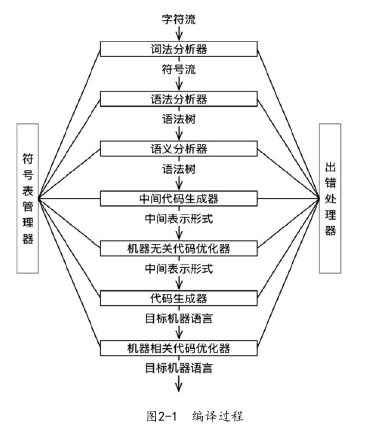

### 编译原理

编译器的结构可分为前端(Front end) 和 后端 (Back end)两部分。

前端是机器无关的,其功能是把源程序分解成组成要素和相应的语法结构,通过这个结构创建源程序的中间表示,同时收集和源程序相关的信息,存放到符号表中;后端则是机器相关的,其功能是根据中间表示和符号表信息构造目标程序。

编译过程可大致分为下面5个步骤,如图2-1所示。
(1)词法分析(Lexical analysis):读入源程序的字符流,输出为有意义的词素(Lexeme);
(2)语法分析(Syntax analysis):根据各个词法单元的第一个分量来创建树型的中间表示形式,通常是语法树(Syntax tree);
(3)语义分析(Semantic analysis):使用语法树和符号表中的信息,检测源程序是否满足语言定义的语义约束,同时收集类型信息,用于代码生成、类型检查和类型转换;
(4)中间代码生成和优化:根据语义分析输出,生成类机器语言的中间表示,如三地址码。然后对生成的中间代码进行分析和优化;
(5)代码生成和优化:把中间表示形式映射到目标机器语言。

#### 

### GCC 编译过程

