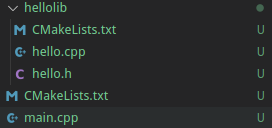
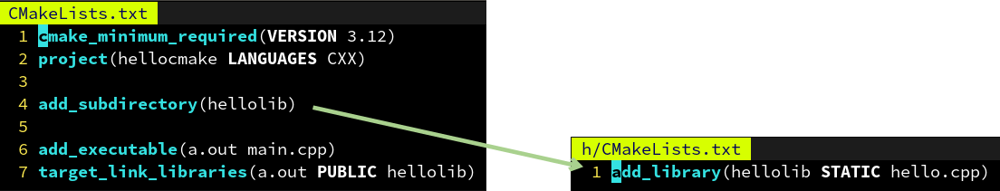
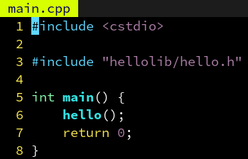
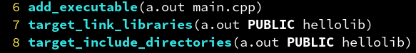
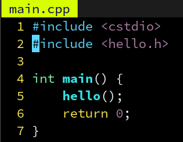
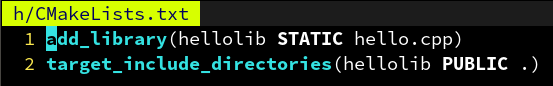

单文件编译虽然方便，但也有如下缺点：

1. 所有的代码都堆在一起，不利于模块化和理解。
2. 工程变大时，编译时间变得很长，改动一个地方就得全部重新编译。

因此，我们提出多文件编译的概念，文件之间通过符号声明相互引用。

```
g++ -c hello.cpp -o hello.o
g++ -c main.cpp -o main.o
```

其中使用 -c 选项指定生成临时的对象文件 main.o，之后再根据一系列对象文件进行链接，得到最终的a.out：

```
g++ hello.o main.o -o a.out
```


为什么需要构建系统（Makefile）

文件越来越多时，一个个调用g++编译链接会变得很麻烦。

于是，发明了 make 这个程序，你只需写出不同文件之间的依赖关系，和生成各文件的规则。

```
make a.out
```

敲下这个命令，就可以构建出 a.out 这个可执行文件了。
和直接用一个脚本写出完整的构建过程相比，make 指明依赖关系的**好处**：
当更新了hello.cpp时只会重新编译hello.o，而不需要把main.o也重新编译一遍。
能够自动并行地发起对hello.cpp和main.cpp的编译，加快编译速度（make -j）。
用通配符批量生成构建规则，避免针对每个.cpp和.o重复写 g++ 命令（%.o: %.cpp）。
**但坏处也很明显：**
make 在 Unix 类系统上是通用的，但在 Windows 则不然。
需要准确地指明每个项目之间的依赖关系，有头文件时特别头疼。
make 的语法非常简单，不像 shell 或 python 可以做很多判断等。
不同的编译器有不同的 flag 规则，为 g++ 准备的参数可能对 MSVC 不适用。


#### 为了解决 make 的以上问题，跨平台的 CMake 应运而生！

1.make 在 Unix 类系统上是通用的，但在 Windows 则不然。

只需要写一份 CMakeLists.txt，他就能够在调用时生成当前系统所支持的构建系统。


2.需要准确地指明每个项目之间的依赖关系，有头文件时特别头疼

CMake 可以自动检测源文件和头文件之间的依赖关系，导出到 Makefile 里。


3.make 的语法非常简单，不像 shell 或 python 可以做很多判断等。

CMake 具有相对高级的语法，内置的函数能够处理 configure，install 等常见需求。


4.不同的编译器有不同的 flag 规则，为 g++ 准备的参数可能对 MSVC 不适用。

CMake 可以自动检测当前的编译器，需要添加哪些 flag。比如 OpenMP，只需要在 CMakeLists.txt 中指明 target_link_libraries(a.out OpenMP::OpenMP_CXX) 即可。


#### CMake 的命令行调用

读取当前目录的 CMakeLists.txt，并在 build 文件夹下生成 build/Makefile：

```
cmake -B build
```

让 make 读取 build/Makefile，并开始构建 a.out：

```
make -C build
```

以下命令和上一个等价，但更跨平台：

```
cmake --build build
```

执行生成的 a.out：

```
build/a.out
```


### 为什么需要库（library）


有时候我们会有多个可执行文件，他们之间用到的某些功能是相同的，我们想把这些共用的功能做成一个库，方便大家一起共享。
库中的函数可以被可执行文件调用，也可以被其他库文件调用。
库文件又分为静态库文件和动态库文件。
其中静态库相当于直接把代码插入到生成的可执行文件中，会导致体积变大，但是只需要一个文件即可运行。
而动态库则只在生成的可执行文件中生成“插桩”函数，当可执行文件被加载时会读取指定目录中的.dll文件，加载到内存中空闲的位置，并且替换相应的“插桩”指向的地址为加载后的地址，这个过程称为重定向。这样以后函数被调用就会跳转到动态加载的地址去。
Windows：可执行文件同目录，其次是环境变量%PATH%
Linux：ELF格式可执行文件的RPATH，其次是/usr/lib等


#### CMake 中的静态库与动态库

CMake 除了 add_executable 可以生成可执行文件外，还可以通过 add_library 生成库文件。
add_library 的语法与 add_executable 大致相同，除了他需要指定是动态库还是静态库：

```
add_library(test STATIC source1.cpp source2.cpp)  # 生成静态库 libtest.a
add_library(test SHARED source1.cpp source2.cpp)  # 生成动态库 libtest.so
```

创建库以后，要在某个可执行文件中使用该库，只需要：
target_link_libraries(myexec PUBLIC test)  # 为 myexec 链接刚刚制作的库 libtest.a


#### CMake 中的子模块



复杂的工程中，我们需要划分子模块，通常一个库一个目录，比如：
这里我们把 hellolib 库的东西移到 hellolib 文件夹下了，里面的 CMakeLists.txt 定义了 hellolib 的生成规则。
要在根目录使用它，可以用 CMake 的 add_subdirectory 添加子目录，子目录也包含一个 CMakeLists.txt，其中定义的库在 add_subdirectory 之后就可以在外面使用。
子目录的 CMakeLists.txt 里路径名（比如 hello.cpp）都是相对路径，这也是很方便的一点。




### 子模块的头文件如何处理

因为 hello.h 被移到了 hellolib 子文件夹里，因此 main.cpp 里也要改成：



如果要避免修改代码，我们可以通过 target_include_directories 指定
a.out 的头文件搜索目录：(其中第一个 hellolib 是库名，第二个是目录)



这样甚至可以用 <hello.h> 来引用这个头文件了，因为通过 target_include_directories 指定的路径会被视为与系统路径等价：



#### 子模块的头文件如何处理（续）

但是这样如果另一个 b.out 也需要用 hellolib 这个库，难道也得再指定一遍搜索路径吗？
不需要，其实我们只需要定义 hellolib 的头文件搜索路径，引用他的可执行文件 CMake 会自动添加这个路径：



这里用了 . 表示当前路径，因为子目录里的路径是相对路径，类似还有 .. 表示上一层目录。
此外，如果不希望让引用 hellolib 的可执行文件自动添加这个路径，把 PUBLIC 改成 PRIVATE 即可。这就是他们的用途：决定一个属性要不要在被 link 的时候传播。