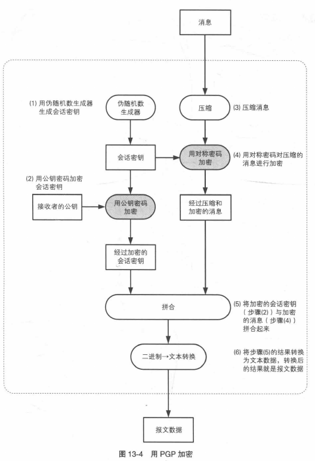
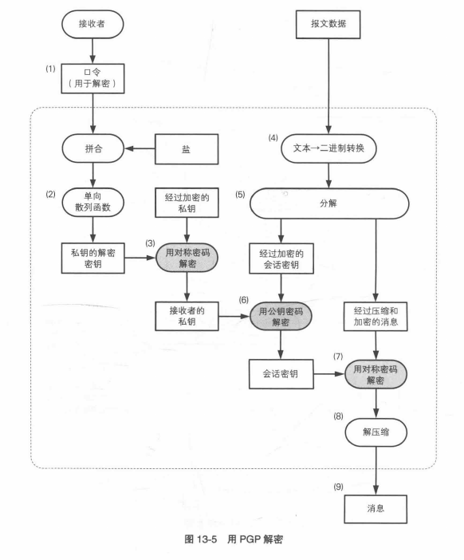

### 是什么

**GPG**, 或 **GnuPG** (GNU Privacy Guard) 是一个遵照 OpenPGP 协议的 *用于加密、数字签名以及认证* 的软件。

它与 PGP (Pretty Good Privacy) 的区别是它是开源的。

`GPG`可以用来实现非对称的**文件加密**、对数据进行**签名**等操作，这也是它最主要的两个用途

1. 供他人验证身份，来证实某消息确实出自自己之手、并且未被第三人修改过。
2. 加密消息，通过他人公开的公钥能够向对方发送加密了的讯息，而只有持有对应私钥的他本人能够解密。

#### 

#### 核心概念介绍

**1. Key** 密钥，每个 Key 都包含两部分：Private Key 和 Public Key。

**2. Fingerprint** 指纹， Public Key 的散列值。


**3. KeyID**，GPG 中使用 fingerprint 来作为 KeyID，用来标识一个 Key。


**4. UserID**，GPG 中也使用 UserID 来标识一个或多个 Key。由于 Key 必须绑定至少一个 UserID（也就是 email 地址）。

**5. Keyring**，密钥环，是指存储密钥的数据库。默认情况下，所有的本地密钥都保存在 ~/.gnupg/pubring.kbx 中


**6. Key Server**，专门用于存放 Public key 的服务器。gnugp 提供了一个免费的 key server [https://keys.openpgp.org/](https://link.zhihu.com/?target=https%3A//keys.openpgp.org/)，当我们执行 `gpg --send-keys [keyid]` 命令来发布一个 public key 的时候，它会自动发送到这个 key server 中去。

另外，当我们执行 `gpg --search-keys [keyid]` 或 `gpg --recv-keys [keyid]` 的时候，也都是会对默认的 key server 中操作。

**7. Keygrip**，是一个 20 字节长度的，与 protocol 无关的的值，通过对 Key 的 modulus 参数计算 MD5 得来。比如，对于使用 RSA 算法的 key，具体实现是把 modules 作为 unsigned integer，并去除二进制高位的 0，然后计算 SHA1 得来。

Keygrip 相比 fingerprint 的特别之处是，它可以唯一标识一个 Key，因为它只跟你的密钥参数（如 modulus）相关，因此在 GPG 和 SSH 中，相同的 keygrip 都表示一个相同的 key。当我们执行 `gpg --gen-key` 命令时，会 keygrip 文件会自动生成在目录 `~/.gnupg/private-keys-v1.d/` 下，并以 keygrip-id.key 命名。

我们可以用 gpg -k --with-keygrip 命令来查看 Key 对应的 keygrip：


keygrip 一个用处是，如果我们只想删除 Master Key，当我们执行 `gpg --delete-secret-keys [master-keyid]`，他会继续追问我们是否删除 subkey，否则会删除失败。这是由于 KeyID/Fingerprint 会关联 Master Key 及所有的 subkey，所以如果你只想单独把 Master Key 删除，那么可以使用它的 keygrip，比如执行如下命令：

```
gpg-connect-agent "DELETE_KEY 5EACE229E5EA90792805777B9163400FE3D189D4" /bye
```

**8. Master Key and Subkey**

当我们使用 `gpg --gen-key` 命令生成 GPG Keys 时，默认会创建一个 Master key 和一个 Subkey。


`PGP`中有密钥对和子秘钥的概念，如果我们只使用主密钥对，那么私钥泄露后只能吊销整个密钥，所以一般不使用主密钥，而是通过产生一系列用途各异的子秘钥进行操作。


- 主私钥必须有【认证 [C]】这个能力，且这项能力只能属于主私钥。
- 主私钥可以同时拥有【认证 [C]】、【签名 [S]】、【身份验证 [A]】三项能力。
- 子私钥可以同时拥有【签名 [S]】、【身份验证 [A]】两项能力。
- 【加密 [E]】能力必须属于独立的子私钥，因为加密用的是不同的算法变体（和签名不一样）。


**Master Key 和 Subkey 是什么关系？**

本质上，Master key 和 Subkey 都是独立生成的，两者在生成时彼此之间并无依赖关系；但是在生成之后，GPG 用一个叫 **Binding Signature** 的东西把两种进行关联。简单来说就是 Master key 对 Subkey 进行签名，声明自己对 Subkey 的 Owner 关系；同时 Subkey 也对 Master Key 进行签名，声明自己对 Master Key 的 Member 或 slave 关系。

我们可以使用 `--check-sigs` 选项来查看 Key 中的签名：


MasterKey 和 Subkey 互相对彼此签名，`--check-sig [keyid]` 显示的是 Master key 所拥有的签名数量，由于 Master key 会对自己签名，再加上 subkey 也会对他签名，所以最下面显示它有 2 个 goog signatures。如果我们只生成 Master Key，那么它会只有一个签名，就是自签名。


##### 内部处理流程

加密：



解密：




##### 应用场景

**邮件加密**

1.消息需要加密

2.需要验证发件人的身份

当我们使用 GPG 给邮件进行加密时，Gmail 会同时收到一个签名公钥的附件。

作者用私钥签名的邮件，收件人可以用 keyserver 上查询到的公钥来验证邮件内容是否真的来自于发件人。


**使用 GPG 密钥来签名你的 git commits**

向 github 仓库提交代码时，如果你的 commit 经过已授权的 GPG Key 签名，那么会显示为绿色的 Verified 状态。


如果你使用了未授权的密钥进行签名，则会显示


或者你的密钥已经授权，但你进行 commit 时使用的并不是跟密钥所绑定的 email（冒充别人或别人冒充你）


对于要求多重签名却又缺少其中某个签名的：


类似的，发布 release，或者添加 tag，通常都应该使用签名以便使得授权主体更加明确。

需要使用签名的场景非常多，可以说覆盖开发和管理的各个方面，有了 GPG 来帮助我们管理自己的密钥，面对各种场景就会得心应手。


**用公钥验证第三方软件的签名**

软件作者在软件发布时，Release 页面通常会同时提供程序文件和签名文件。

我们可以在拿到作者的公钥后对签名进行验证。

如果验证失败，那么说明下载的软件已经被篡改。这种情况通常发生在有恶意的人下载作者的软件之后，修改软件注入木马，然后重新发布到假的镜像站点；如果你从镜像站点下载了软件却没有对其签名进行验证，使用这种软件就会存在风险。


**使用公钥认证来实现授权登陆 (Public Key Authentication)**

Publick Key Authentication （公钥认证）是服务器最常见的应用，比如 SSH 登陆。具体的方式就是把需要登陆的用户的公钥提交到服务器上 ~/.ssh/authorized_keys，服务器上的 sshd 程序使用公钥加密一个 shared key 发给用户，用户用私钥解密后得到 shared key，实现认证；并且双方在后续的通信中使用这把对称密钥进行加密通信。


如果你在 ～/.ssh/ 目录中生成了太多的 key pairs，管理这些 keys 肯定会让你头疼，而如果你使用 gpg 来管理这些密钥的话，就会方便很多。

可以使用 gpg keys 来替代原来的 ssh keys ，管理起来更加方便和简单。

gpg 生成的密钥格式与 ssh-keygen 所生成的密钥格式不相同，但是可以使用 --export-ssh-key 命令选项来导出 ssh 格式的公钥，并借助 gpg-agent 加载私钥，从而使得 ssh 可以使用 gpg 的密钥建立加密连接。

**使用 GPG Key 做 SSH 认证**做法很简单，步骤如下：

- 导出 SSH 格式的公钥，并上传到服务器

```text
gpg --export-ssh-keys 64810DE8 > ~/.ssh/gpg_subkey.pub
ssh-copy-id -i ~/.ssh/gpg_subkey.pub server:./
ssh server
cat gpg_subkey.pub >> ~/.ssh/authorized_keys
```

- 关掉 ssh-agent，启动 gpg-agent

```text
echo enable-ssh-support >> $HOME/.gnupg/gpg-agent.conf

cat >> ~/.bashrc << EOF
unset SSH_AGENT_PID
if [ "${gnupg_SSH_AUTH_SOCK_by:-0}" -ne $$ ]; then
  export SSH_AUTH_SOCK="$(gpgconf --list-dirs agent-ssh-socket)"
fi
export GPG_TTY=$(tty)
EOF

gpg-connect-agent updatestartuptty /bye >/dev/null
```

- 测试登陆 SSH

```text
ssh -T git@github.com
```


### 具体使用

#### **生成密钥**

安装成功后，使用gen-ken参数生成自己的密钥。

```
gpg --gen-key
```

也可以用

```
gpg --expert --full-gen-key
```

这个命令可以提供更详细的信息以及更多选项。


#### **密钥管理**

##### **列出密钥**

list-keys参数列出系统中已有的密钥．

`gpg --list-keys`

第一行显示公钥文件名（pubring.gpg），第二行显示公钥特征（4096位，Hash字符串和生成时间），第三行显示"用户ID"，第四行显示私钥特征。 


如果你要从密钥列表中删除某个密钥，可以使用delete-key参数。

```
gpg --delete-key [用户ID]
```

但是会提示：

gpg: 存在一个私钥对应于公钥 “fakename”！
gpg: 请先使用“--delete-secret-keys”选项来删除它。

这是由于 KeyID/Fingerprint 会关联 Master Key 及所有的 subkey，所以如果你只想单独把 Master Key 删除，那么可以使用它的 keygrip。


##### **输出密钥**

公钥文件（.gnupg/pubring.gpg）以二进制形式储存，-a 可以将其转换为文本文件格式。因为二进制格式不太方便在网络上展示，所以推荐文本格式。

```
gpg -a --output public-key.txt --export [用户ID]
```

"用户ID"指定哪个用户的公钥，output参数指定输出文件名（public-key.txt）。

类似地，export-secret-keys参数可以转换私钥。

```
gpg -a --output private-key.txt --export-secret-keys
```


##### **输入密钥**

可以使用import参数将他人的公钥或者你的其他密钥输入系统。

```
gpg --import [密钥文件]
```

为了获得他人的公钥，可以让对方直接发给你，或者到公钥服务器上寻找。


#### 加解密

##### **加密**

```
gpg -a --output demo.en.txt -r [用户ID]  -e demo.txt
```

-r(recipient) 指定接收者的公钥，可以是名字也可以是email地址。

--output指定加密后的文件

-e(encrypt) 指定源文件。

运行上面的命令后，demo.en.txt就是已加密的文件，可以把它发给对方。


*对称加密*

Symmetric 对称
对称加密不需要生成密钥对，可用于简单地使用密码对数据进行加密。只需使用 -c / --symmetric 即可执行对称加密：

```
$ gpg -c doc
```

以下示例：
使用密码 doc 使用对称密码进行加密
使用 AES-256 密码算法对数据进行加密
使用 SHA-512 摘要算法修改密码并生成加密密钥
修改 65536 次迭代的密码

```
$ gpg -c --s2k-cipher-algo AES256 --s2k-digest-algo SHA512 --s2k-count 65536 doc
```


##### **解密**

```\
gpg demo.en.txt
```

可以加上 -d ，使解密后的文件内容直接显示在标准输出。


*对称密码解密*

要使用密码对称加密 doc.gpg 进行解密，并将解密的内容输出到同一目录中，请执行以下 doc 操作：

$ gpg --output doc --decrypt doc.gpg


#### 数字签名

##### 签名方法 1

```
$ gpg -a -b message.txt
```

-a 表示输出文本文件格式。 

-b 表示以生成独立的签名文件的方式进行签名。

命令执行完毕之后，会在当前文件夹里产生一个 message.txt.asc 的文件，这个文件即签名。现在我应该把原信息文件 message.txt 连同签名文件 message.txt.asc 一起寄给你，然后你使用如下命令检验：

```
$ gpg --verify message.txt.asc
```

提示：如果你有多个私钥，在签名时需要加上参数 -u 指定私钥的 uid。


##### 签名方法 2

如果不想生成一个独立的签名文件，则还可以用如下的命令进行签名：

```
$ gpg -a --clearsign message.txt
```

用参数 –clearsign 替代了参数 -b， 表示将签名和原信息合并在一起，并生成一个新文件。

命令运行后同样会生成一个文件 message.txt.asc，把里面的相关内容复制至 abc.txt 中。

```
$ gpg --verify abc.txt
```

使用如下命令可以把原始信息提取出来：

```
$ gpg -d abc.txt
```


#### 把公钥发布到公钥服务器

公钥服务器储存和发布用户的公钥，GnuPG 默认的公钥服务器是 keys.gnupg.net。

```
$ gpg --keyserver keys.gnupg.net --send-key 你的公钥ID
```

 –keyserver 用于指定公钥服务器，没有特殊需求的话是可以省略这个参数的

 –send-key 用于指定待发布的公钥的id。


如果有重名的情况，这里会列出多条记录。

当你看到id和uid都跟你要找的那个吻合时，输入搜索结果前面显示的数字就可以把相应的公钥下载到本机。


如果你确切知道要导入的公钥的id，也可以跳过搜索这步而直接使用如下的命令导入：

```
$ gpg --keyserver keys.gnupg.net --recv-key 想要导入的公钥id
```


##### OpenPGP的公钥发布与吊销证书

  上传时需要包含email，所以可能暴露你的email等信息。

  如果你将公钥发布到密钥服务器（各个公钥服务器会互相同步），那么你将永远无法从密钥服务器上删除你的公钥信息。唯一的补救措施是：你事先生成了吊销证书，使用吊销证书可以吊销公钥证书，使公钥其显示“吊销”字样，**但依然无法从密钥服务器上删除公钥信息！所以务必要谨慎上传公钥，务必生成吊销证书备用！**

为新生成的密钥自动生成吊销证书。默认情况下，它们位于 `~/.gnupg/openpgp-revocs.d/` 中。证书的文件名是它将吊销的密钥的指纹。用户以后也可以使用以下方法手动生成吊销证书：

```
$ gpg --gen-revoke --armor --output revcert.asc user-id
```


#### 实战：以 git 为例

为代码签名并提交
  为了不用每次提交 commit 的时候都要手动声明使用某个 GPG 私钥进行签名，这里在 git 的全局配置中添加两个配置项：user.signingkey（签名密钥 ID）和 commit.gpgsign（全部提交使用 GPG 签名）。

```
git config --global user.signingkey 612E7E8200528FEC0B8AC3C715F73C3703B9796C
git config --global commit.gpgsign true
```

当我们设置好全局 Git 配置后，再次像平常那样执行 commit 提交时，就会弹出输入私钥密码的窗口，正常输入即可。


**为发布打标签**

如果你为标签签名了，你可能会遇到分发 PGP 公钥的问题。 Git 项目的维护者已经解决了这一问题，其方法是在版本库中以 blob 对象的形式包含他们的公钥，并添加一个直接指向该内容的标签。

 要完成这一任务，首先你可以通过运行 `gpg --list-keys` 找出你所想要的 key：

```console
$ gpg --list-keys
/Users/schacon/.gnupg/pubring.gpg
---------------------------------
pub   1024D/F721C45A 2009-02-09 [expires: 2010-02-09]
uid                  Scott Chacon <schacon@gmail.com>
sub   2048g/45D02282 2009-02-09 [expires: 2010-02-09]
```

之后你可以通过导出 key 并通过管道传递给 `git hash-object` 来直接将 key 导入到 Git 的数据库中，`git hash-object` 命令会向 Git 中写入一个包含其内容的新 blob 对象，并向你返回该 blob 对象的 SHA-1 值：

```console
$ gpg -a --export F721C45A | git hash-object -w --stdin
659ef797d181633c87ec71ac3f9ba29fe5775b92
```

既然 Git 中已经包含你的 key 的内容了，你就可以通过指定由 `hash-object` 命令给出的新 SHA-1 值来创建一个直接指向它的标签：

```console
$ git tag -a maintainer-pgp-pub 659ef797d181633c87ec71ac3f9ba29fe5775b92
```

如果你运行 `git push --tags` 命令，那么 `maintainer-pgp-pub` 标签将会被共享给所有人。 需要校验标签的人可以通过从数据库中直接拉取 blob 对象并导入到 GPG 中来导入 PGP key：

```console
$ git show maintainer-pgp-pub | gpg --import
```

人们可以使用这个 key 来校验所有由你签名的标签。 另外，如果你在标签信息中包含了一些操作说明，用户可以通过运行 `git show <tag>` 来获取更多关于标签校验的说明。

#### 签署标签

如果已经设置好一个 GPG 私钥，可以使用它来签署新的标签。 所有需要做的只是使用 `-s` 代替 `-a` 即可：

```console
$ git tag -s v1.5 -m 'my signed 1.5 tag'

You need a passphrase to unlock the secret key for
user: "Ben Straub <ben@straub.cc>"
2048-bit RSA key, ID 800430EB, created 2014-05-04
```

如果在那个标签上运行 `git show`，会看到你的 GPG 签名附属在后面：

```console
$ git show v1.5
tag v1.5
Tagger: Ben Straub <ben@straub.cc>
Date:   Sat May 3 20:29:41 2014 -0700

my signed 1.5 tag
-----BEGIN PGP SIGNATURE-----
Version: GnuPG v1

iQEcBAABAgAGBQJTZbQlAAoJEF0+sviABDDrZbQH/09PfE51KPVPlanr6q1v4/Ut
LQxfojUWiLQdg2ESJItkcuweYg+kc3HCyFejeDIBw9dpXt00rY26p05qrpnG+85b
hM1/PswpPLuBSr+oCIDj5GMC2r2iEKsfv2fJbNW8iWAXVLoWZRF8B0MfqX/YTMbm
ecorc4iXzQu7tupRihslbNkfvfciMnSDeSvzCpWAHl7h8Wj6hhqePmLm9lAYqnKp
8S5B/1SSQuEAjRZgI4IexpZoeKGVDptPHxLLS38fozsyi0QyDyzEgJxcJQVMXxVi
RUysgqjcpT8+iQM1PblGfHR4XAhuOqN5Fx06PSaFZhqvWFezJ28/CLyX5q+oIVk=
=EFTF
-----END PGP SIGNATURE-----

commit ca82a6dff817ec66f44342007202690a93763949
Author: Scott Chacon <schacon@gee-mail.com>
Date:   Mon Mar 17 21:52:11 2008 -0700

    changed the version number
```

#### 验证标签

要验证一个签署的标签，可以运行 `git tag -v [tag-name]`。 这个命令使用 GPG 来验证签名。 为了验证能正常工作，签署者的公钥需要在你的钥匙链中。

```console
$ git tag -v v1.4.2.1
object 883653babd8ee7ea23e6a5c392bb739348b1eb61
type commit
tag v1.4.2.1
tagger Junio C Hamano <junkio@cox.net> 1158138501 -0700

GIT 1.4.2.1

Minor fixes since 1.4.2, including git-mv and git-http with alternates.
gpg: Signature made Wed Sep 13 02:08:25 2006 PDT using DSA key ID F3119B9A
gpg: Good signature from "Junio C Hamano <junkio@cox.net>"
gpg:                 aka "[jpeg image of size 1513]"
Primary key fingerprint: 3565 2A26 2040 E066 C9A7  4A7D C0C6 D9A4 F311 9B9A
```

如果没有签署者的公钥，那么你将会得到类似下面的东西：

```console
gpg: Signature made Wed Sep 13 02:08:25 2006 PDT using DSA key ID F3119B9A
gpg: Can't check signature: public key not found
error: could not verify the tag 'v1.4.2.1'
```

#### 签署提交

在最新版本的 Git 中（v1.7.9 及以上），也可以签署个人提交。 如果相对于标签而言你对直接签署到提交更感兴趣的话，所有要做的只是增加一个 `-S` 到 `git commit` 命令。

```console
$ git commit -a -S -m 'signed commit'

You need a passphrase to unlock the secret key for
user: "Scott Chacon (Git signing key) <schacon@gmail.com>"
2048-bit RSA key, ID 0A46826A, created 2014-06-04

[master 5c3386c] signed commit
 4 files changed, 4 insertions(+), 24 deletions(-)
 rewrite Rakefile (100%)
 create mode 100644 lib/git.rb
```

`git log` 也有一个 `--show-signature` 选项来查看及验证这些签名。

```console
$ git log --show-signature -1
commit 5c3386cf54bba0a33a32da706aa52bc0155503c2
gpg: Signature made Wed Jun  4 19:49:17 2014 PDT using RSA key ID 0A46826A
gpg: Good signature from "Scott Chacon (Git signing key) <schacon@gmail.com>"
Author: Scott Chacon <schacon@gmail.com>
Date:   Wed Jun 4 19:49:17 2014 -0700

    signed commit
```

另外，也可以配置 `git log` 来验证任何找到的签名并将它们以 `%G?` 格式列在输出中。

```console
$ git log --pretty="format:%h %G? %aN  %s"

5c3386c G Scott Chacon  signed commit
ca82a6d N Scott Chacon  changed the version number
085bb3b N Scott Chacon  removed unnecessary test code
a11bef0 N Scott Chacon  first commit
```

这里我们可以看到只有最后一次提交是签署并有效的，而之前的提交都不是。

在 Git 1.8.3 及以后的版本中，“git merge” 与“git pull” 可以使用 `--verify-signatures` 选项来检查并拒绝没有携带可信 GPG 签名的提交。

如果使用这个选项来合并一个包含未签名或有效的提交的分支时，合并不会生效。

```console
$ git merge --verify-signatures non-verify
fatal: Commit ab06180 does not have a GPG signature.
```

如果合并包含的只有有效的签名的提交，合并命令会提示所有的签名它已经检查过了然后会继续向前。

```console
$ git merge --verify-signatures signed-branch
Commit 13ad65e has a good GPG signature by Scott Chacon (Git signing key) <schacon@gmail.com>
Updating 5c3386c..13ad65e
Fast-forward
 README | 2 ++
 1 file changed, 2 insertions(+)
```

也可以给 `git merge` 命令附加 `-S` 选项来签署自己生成的合并提交。 下面的例子演示了验证将要合并的分支的每一个提交都是签名的并且签署最后生成的合并提交。

```console
$ git merge --verify-signatures -S  signed-branch
Commit 13ad65e has a good GPG signature by Scott Chacon (Git signing key) <schacon@gmail.com>

You need a passphrase to unlock the secret key for
user: "Scott Chacon (Git signing key) <schacon@gmail.com>"
2048-bit RSA key, ID 0A46826A, created 2014-06-04

Merge made by the 'recursive' strategy.
 README | 2 ++
 1 file changed, 2 insertions(+)
```

#### 每个人必须签署

签署标签与提交很棒，但是如果决定在正常的工作流程中使用它，你必须确保团队中的每一个人都理解如何这样做。 如果没有，你将会花费大量时间帮助其他人找出并用签名的版本重写提交。 在采用签署成为标准工作流程的一部分前，确保你完全理解 GPG 及签署带来的好处。


### 分享

