# 分组密码的模式

像AES和DES这样的分组密码只能固定长度的明文，如果要加密超过这个长度的数据，就需要重复迭代，这个迭代方法就称为分组密码的模式。

## 分组密码的模式

#### 分组密码和流密码

**分组密码**：每次只能处理特定长度的一块数据。每次处理的那“一块”称为一组，而一组的比特数则称为分组长度。

**流密码**：对数据流进行连续处理。以1比特、8比特或32比特等为单位进行加密和解密。因为是连续处理的，所以要保持内部状态来记录加密的进度。

#### 分组密码的主要模式

- ECB模式：Electronic CodeBook mode（电子密码本模式）
- CBC模式：Cipher Block Chaining mode（密码分组链接模式）
- CFB模式：Cipher FeedBack mode（密文反馈模式）
- OFB模式：Output FeedBack mode（输入反馈模式）
- CTR模式：CounTeR mode （计数器模式）

#### 明文分组和密文分组

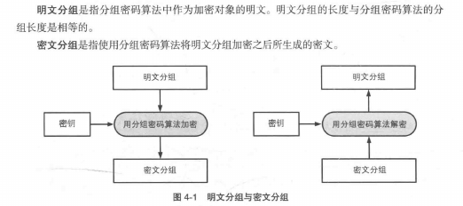

## ECB 模式

将明文分组直接加密后作为密文分组。在ECB中，相同的明文分组将被转化为相同的密文分组，这意味着我们可以将它理解为巨大的一个“明文分组->密文分组”的对应表，因此ECB也称为**电子密码本模式**（这个密码本应该指的是简单替换密码）。根据这个特性，我们看看密文中那些重复的部分，就可以推出一些破译密码的线索。

当最后一个明文分组的内容小于分组长度时，需要用一些特定的数据进行**填充**。

#### 对ECB的攻击

假设主动攻击者Mallory 能替换、复制、删除密文分组，那么他就可以在不知道明文具体内容的情况下按他想要的方式操作明文。

比如：

明文分组1 = 付款人	明文分组2 = 收款人	明文分组3 = 转账金额

加密形成相应的密文分组。

于是，Mallory只需调换密文分组1和密文分组2，就能使原来的收款人给原来的付款人转账。

不过，这种篡改可以通过消息认证码检测出来。

## CBC模式

全称 Cipher Block Chaining 模式（密码分组链接模式），密文分组像链条一样相互连接在一起。

#### 什么是CBC模式

每次加密前首先将明文与上一轮的密文分组异或，然后再加密。

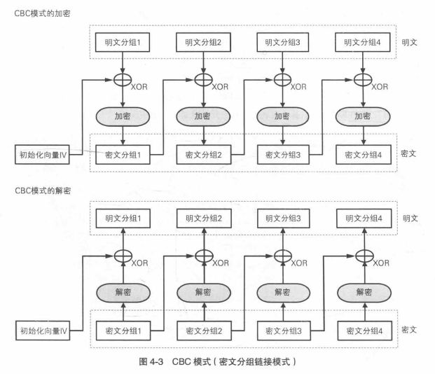

##### 初始化向量

第一个明文分组用 长度为一个分组的比特序列 来代替“前一个密文分组”，这个比特序列称为**初始化向量**，通常缩写为 **IV**

#### 对 CBC 模式的攻击

假设Mallory反转初始化向量的某一位比特，那么第一个明文分组的对应比特也将被修改。因为初始化向量与密文解密后的结构异或，反转后原来一样的变成不一样的（0 -> 1），原来不一样的变为一样的（1 -> 0 ）

但如果Mallory 反转密文分组1的某一位比特，并企图以此只改变明文分组1的特定比特，他会发现这非常困难。因为改变了密文分组1，将对明文分组1的多个比特造成影响，而且对后面的明文分组2也有影响。

另外，通过消息验证码，可以判断消息有没有被篡改。

#### 填充提示攻击

分组密码如果最后明文的长度不能刚好凑成一个分组，就要填充一些数据。

于是就有了填充提示攻击，这是个对所有需要填充分组的密码都适用的攻击。

攻击者不断发送同一段密文并更改填充的东西，如果无法正确解密，服务器会反馈错误信息。攻击者根据这个反馈可以推理出明文的蛛丝马迹来。

要防御这种攻击，需要对密文进行认证，确保这段密文的确是由合法的发送者在知道明文内容的前提下发送的。

CTS模式：使用最后一个分组的前一个密文分组数据来填充。它有几个变体（CBC-CS1、CBC-CS2、CBC-CS3）下面介绍的是CBC-CS3。

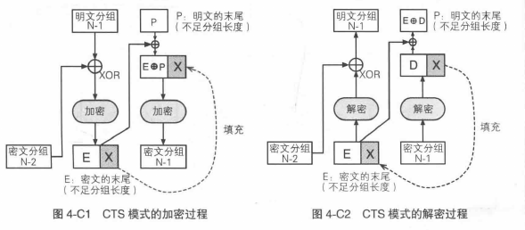

这里最后两个密文分组调换了下位置，因为X要用于填充，然后加密完形成一个完整的密文分组。再舍弃X后刚好和原文就长度一样了。

#### CBC 模式的应用实例

确保互联网安全通信协议之一SSL/TLS，就是使用CBC模式来确保通信的机密性的，如使用CBC模式三重DES的3DES_EDE_CBC以及CBC模式256比特AES的AES_256_CBC等。

## CFB 模式

#### 什么是 CFB 模式

全称为Cipher FeedBack模式（密文反馈模式）

所谓反馈，就是密文分组反馈为新一轮的加密材料的意思。

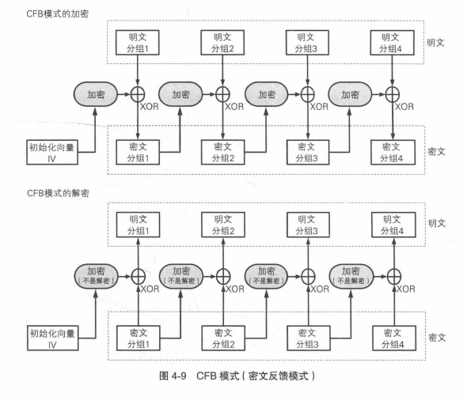

##### 初始化向量

和CBC模式一样，需要在每次加密前生成一个随机的比特串作为初始化向量。

#### CFB 模式与流密码

CFB其实很像一次性密码本，每次明文分组都与随机比特串异或得到密文分组。

不过，CFB的随机其实是伪随机，刚开始的初始化向量就是伪随机生成器（密码算法）的种子。这也意味着无法像一次性密码那样拥有绝对安全性。

CFB生成密钥流，使得明文可以逐字符加密。所以我们可以将CFB模式看作是一种使用分组密码来实现流密码的方式。

#### 对 CFB 模式的攻击

重放攻击(replay attack)

Alice给Bob发消息。

Mallory用以前的密文分组2、3、4替换现在的，结果2解密失败，3、4解密成功（以前的内容）。Bob无从得知是2出问题是由于单纯的通信错误还是被攻击了。如果想做出这样的判断，要使用消息认证码。

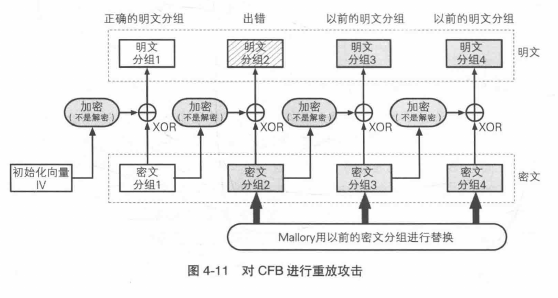

## OFB 模式

Output-Feedback模式（输出反馈模式）

CFB的输入是上次的密文分组，而OFB的输入是密码算法的前一个输出。

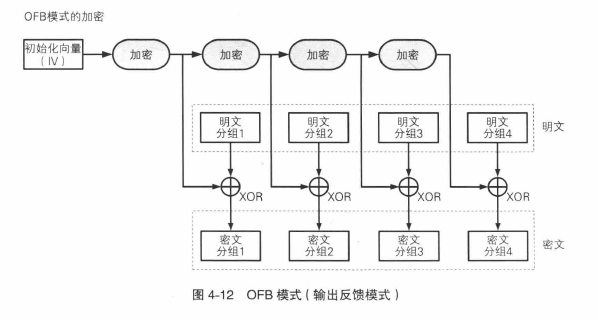

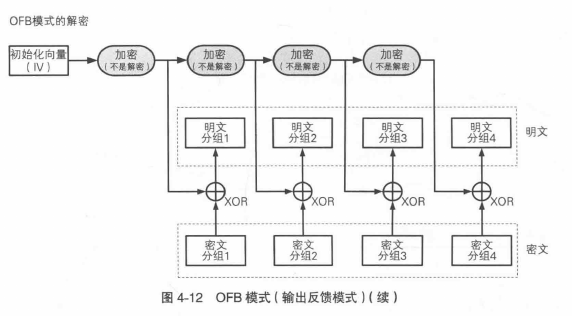

CFB对密文分组进行反馈，所以无法跳过明文分组1加密明文分组2。相对的，OFB中，XOR所需要的比特序列（密钥流）可以事先通过密码算法生成，和明文分组无关。换句话说，OFB产生密钥流和加密可以并行。

## CTR 模式

CounTeR模式（计数器模式），是一种通过将逐次累加的计数器进行加密来生成密钥流的流密码。

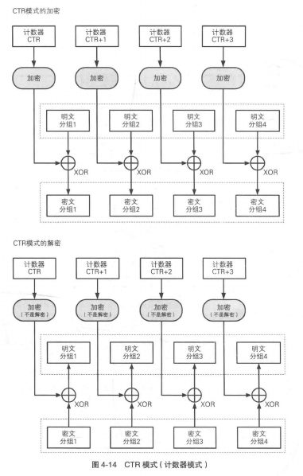

#### 计数器的生成方法

每次加密前都会生成一个不同的值(nonce)来作为计数器的初始值。

比如16字节像下面这样：

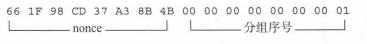

加密过程中，计数器的值会产生如下变化：

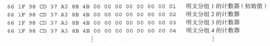

#### OFB 模式与CTR模式的对比

OFB将加密的输出反馈给输入，而CTR 模式则是将计数器的值用作输入。

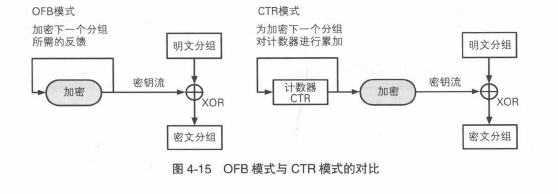

只要知道nounce的值及序号就可以加密，这样意味着可以以任意的顺序处理分组，能够并行计算。

#### 错误及机密性

有一个跟OFB差不多的性质，改变密文分组的一个字符，只会对明文分组中相应的（一个或多个）比特进行改变，不会放大发生连锁反应。

有一个比OFB好的性质：在OFB中，如果对密钥流的一个分组进行加密后其结果碰巧和加密前是相同的，那么这一分组之后的密钥流就会变成同一值的不断反复。而CTR中就不存在这种问题。

> 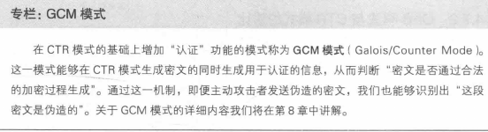

## 应该使用哪种模式

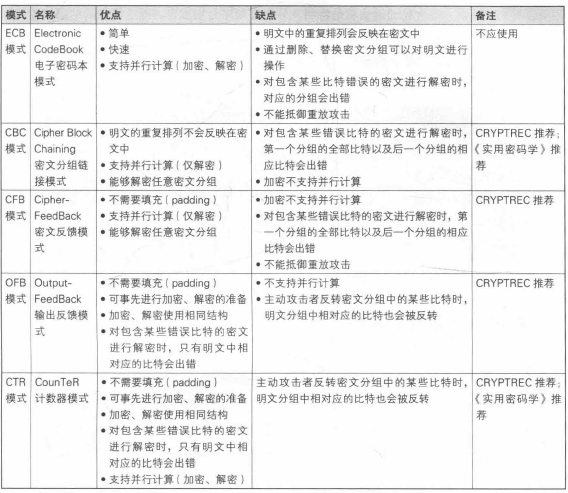
