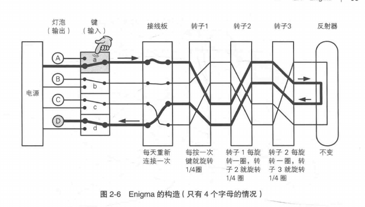
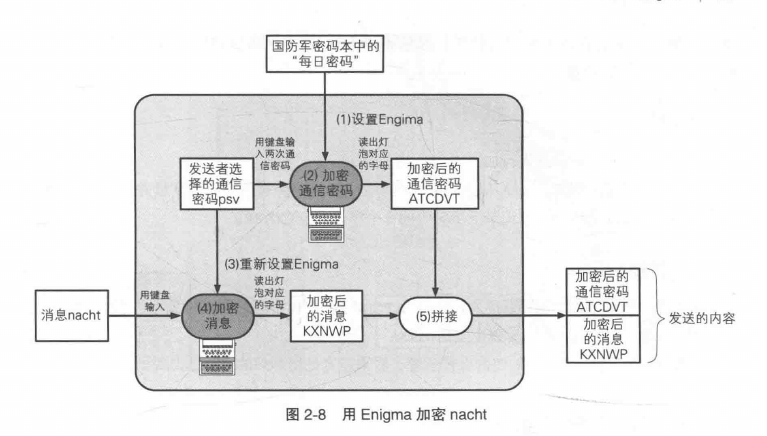
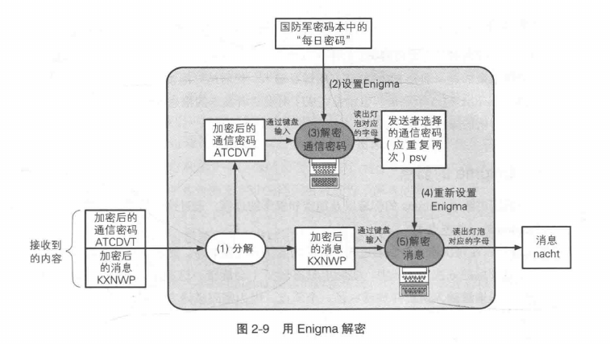

# 历史上的密码

破解凯撒密码的时候，可以将所有可能的密钥全部尝试一遍，这种方法称为**暴力破解**。由于这种方法的本质是在一堆东西中一个个排除寻找到正确的东西，所以又称**穷举搜索**。

我们把所有密钥的集合称为密钥空间。因为简单替换密码的密钥空间比凯撒密码大的多，所以通过穷举搜索密钥的方式暴力破解很困难。

## Enigma

#### 基本构造

一个人打字，另一个人看亮起来的灯泡并记录。

接线板、转子都能改变字母的对应关系。

接线板由德军密码本的每日密码决定，一天之内不会改变。

转子内部接线不会改变，但是当打字时会旋转，这意味着每打一个字后字母的对应关系都将被改变。这3个轮子可以拆卸，在对Enigma进行设置时可以选择转子的顺序以及它们的初始位置。

#### 加密步骤

1、设置Enigma

根据每日密码本上的内容设置转子的顺序、初始位置以及接线板的接线

2、加密通信

发送者想出3个字母，在Enigma上将这三个字母重新打两次。记录下生成的密文作为加密后的通信密码

3、重新配置Enigma

刚想出的3个字母实际上决定了轮子的初始位置（比如psv的意思就是,第一个轮子初始位置在p，第二个在s，第三个在v）。

4、加密信息

用刚刚配置的Enigma加密明文

5、拼接

将加密后的通信密码ATCDVT与加密后的信息KXNWP拼接，将ATCDVTKXNWP作为电文通过无线电发送出去。

##### 每日密码与通信密码

通信密码加密消息，每日密码加密通信密码。像每日密码这样的密钥通常被成为密钥加密密钥(KEK)。之所以用两重加密，是因为同一个密钥加密的密文越多，相关线索就越多，越容易被破译。

##### 避免通信错误

psv连续输入两次是为了对通信密码进行校验。

#### 解密步骤

1、分解

将受到的电文分解为两个部分，即加密后的通信密码和信息

2、设置Enigma

根据每日密码本设置Enigma

3、解密通信密码

对通信密码进行解密，得到Enigma的设置信息

4、重新设置Enigma

根据解密后的通信密码设置

5、解密信息

输入电文，读取结果并记下来就得到了明文
