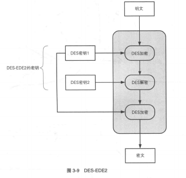

# 对称密码

## 从文字密码到比特序列密码

##### 编码

将现实世界的东西映射为比特序列的操作的操作称为 *编码*

##### XOR

明文A，密钥B。

- 加密得到密文$A\oplus B$
- 解密，直接用密钥再次异或密文$B\oplus B=0$，$0\oplus A=A$

## 一次性密码本

运用刚才讲的XOR，其中密钥是一串和明文一样长的字符串。

#### 一次性密码本无法被破译

一次性密码本是无法被破译的。这是因为在暴力枚举所有密钥的时候，所有字符串可能性都会出现。

#### 为什么几乎不用

一句话，它太长了。

*1.密钥的配送*

如果有能力把这么长的一串密钥安全地发送，那我为什么不直接传明文呢？

*2.密钥的保存*

要保证保存时不被外界窃取。然而只是把“保护明文”替换成“保护和明文一样长的密钥”而已。

*3.密钥的重用*

绝对不能用过去的密钥，这会导致如果这次泄漏了，过去所有的都会被解密

*4.密钥的同步*

*5.密钥的生成*

需要大量随机数

## DES

#### 加密和解密

DES是一个将64比特位的明文转成64比特位密文的算法。

它的密钥是56位的。然而，因为它每隔7个比特位有一个用于纠错的位，所以实际总共占64位。

在加密大于64位的明文时，它以64位为一个单位进行加密，这个64比特的单位称为分组。以分组为单位的密码算法称为分组密码，DES是分组密码。在加密时，这个加密的动作不断迭代（重复），而迭代的具体方式就称为模式。

#### DES 的结构（Feistel 网络）

在Feistel网络中，加密的各个步骤称为轮，整个加密过程就是轮的不断重复。DES 是一种16轮循环的 Feistel网络。

一组64位被分成两块，我们在图上将一块作为左侧，还有一块作为右侧。右侧的那块保持不变，同时经过轮函数 f （注意这个子密钥只是局部密钥，每轮加密都会变），生成一串比特序列。这个比特序列再与左侧异或，于是左侧的内容得到加密。

你问那右边岂不是没有加密？我知道你很急，但你先别急……

你看，刚才那个仅仅是一轮罢了。在第二轮开始的时候，左右互换，刚刚加密的就成了不改变的右侧，刚刚的右侧就成了第二轮的左侧，会像第一轮的左侧那样被加密。

注意只需要在加密前对调就好了，最后加密完后左右不用对调。

解密需要用到异或的知识，其实就跟一次性密码本的解密道理是一样的。

刚刚加密反着再来一遍，就算是解密了。

从上面可以发现并总结出**轮函数的性质**：

1. 轮数任意
2. 轮函数想设置得多复杂就设置得多复杂
3. 加密和解密可以用相同的结构来实现

#### 差分分析与线性分析

差分分析：通过改变明文的一部分，通常来说这时候密文会有大改变，对密文中的改变进行分析，可以获得破译密码的线索。

线性分析：将明文和密文进行异或运算，如果密文随机，那么将出现0的概率将接近1/2，如果找到大幅偏离这个概率的部分，可以推出关于明文的一些信息。

差分分析和线性分析的前提是密码破译者能够选择任意明文并得到其加密的结果，这种攻击方式称为选择明文攻击(Chosen Plaintext Attack,CPA)。

## 三重DES

#### 三重DES的加密

为了增强DES的强度，将其重复3次。也叫TDEA(Triple Data Encryption Algorithm)，通常缩写为3DES。

注意第二次是“解密”而非“加密”，但是其实前面说过，加密和解密其实没什么差别。解密不过仅仅是子密钥顺序使用相反的加密罢了。

如果三次加密的密钥都相同，就跟普通的DES一样。因为前两次用相同的密钥先加密后解密的结果就跟原来的明文一样。这意味着三重DES可以向下兼容DES。

如果密钥1、密钥3相同，中间使用不一样的密钥，称为 DES-EDE2（EDE表示的是 加密->解密->加密  这个流程）

如果三次密钥都不一样，称为DES-EDE3。

#### 三重DES的解密

就是把加密反着来一遍

## AES (Advanced Encryption Standard)

#### 什么是AES?

AES是来替代原来标准（DES）的新标准的一种对称密码算法。在多个密码竞争后，最终选出 **Rijndael** ，将其确定为了AES。

## Rijndael

Rijindael是新一代的标准密码算法——AES。

它的分组长度和密钥长度可以分别以32比特为单位在128比特到256中间横跳选择。但是作为AES的它，分组长度被固定在128位，密钥长度只有128、192和256比特3种。

#### Rijndael 的加密和解密

和DES一样，Rijndael 算法也是由多个轮构成的，每一轮共四个步骤。Rijndael使用的是 **SPN结构**

Rijndael 128位为一组。以一个字节（8位）为一个单位，我们可以将它画作一个 4*4 的一个表。

*加密： SubBytes -> ShiftRows -> MixColumns -> AddRoundKey*

##### SubBytes

相当于一个256个字母版本的简单替换密码。有一个S盒能把一个字节的值（0～255的任意值）映射成另一个 1字节的值（0～255的任意值）。每一个字节都要经过这样的替换。

##### ShiftRows

将每一 4字节的行按照一定的规则向左平移不同的字节数。

##### MixColumns

将每一列经过变换后形成新列

##### AddRoundKey

将刚经过MixColumns处理的结果每一字节都与相应的轮密钥进行异或运算

这样，一轮就结束了。实际上，在Rijndael中需要重复进行 10～14 轮计算。

*解密：AddRoundKey -> InvMixColumns -> InvShiftRows -> InvSubBytes*

反着来一遍就是，就不多赘述了。

