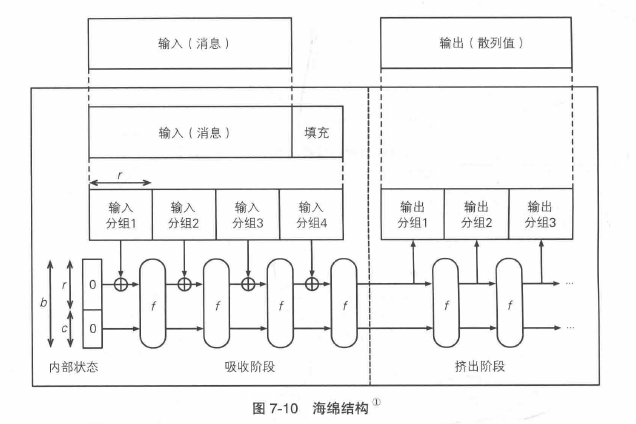
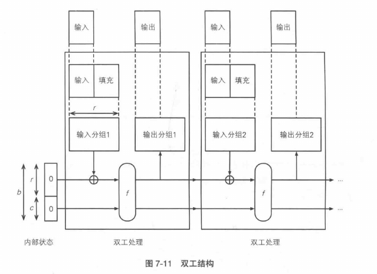
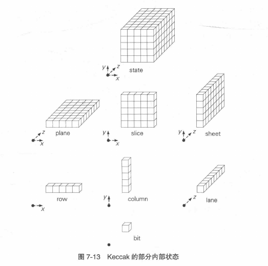

# SHA-3(keccak)

### 简介

单向散列函数算法

可以接受、输出任意长度的散列值。但是为了配合SHA-2输出的散列值长度，SHA-3 中共规定了 SHA3-224、SHA3-256、SHA3-384、SHA3-512 这四种版本。

### 海绵结构

Keccak 采用了与 SHA-1、SHA-2 完全不同的海绵结构。

**吸收阶段：**

1. 经过填充的输入消息，被 r 个一组进行分组
2. 将 "内部状态的 r 个比特" 与 "输入分组1"（也是r个比特）进行异或，作为函数 f 的输入
3. 把函数 f 的输出与输入分组2进行异或，其结果再次作为 "函数 f 的输入值"
4. 依次类推，一直到最后一个输入分组

每次输入中都有 r 个比特被加入到函数 f 中搅拌，因此 r 被称为比特率。同时注意 f 的输入是 r+c 个比特，这里的 c 被称为容量。

**挤出阶段**

1. 将 r 个比特作为输出分组1，然后继续 f 搅拌
2. 其他同 步骤1，直到获得所需长度的输出数据

在挤出阶段中，f 的输入不会直接进入输出分组，只会间接影响输出的内容。因此，容量 c 的意义在于防止将输出消息中的一些特征泄漏出去。

### 双工结构

海绵结构的变形，输入和输出可以同时进行

即：一边处理生成输出分组1，一边和输入分组2进行异或。

### Keccak 的内部状态

一个三维的比特数组

Kecckak 本质就是实现一个能对这个状态数组进行搅拌的函数 f 。这个内部状态可以代表所有中间过程的状态，因此可以节省内存。Keccak 用到了很多比特单位的运算，因此被认为可以有效抵御字节单位的攻击。
