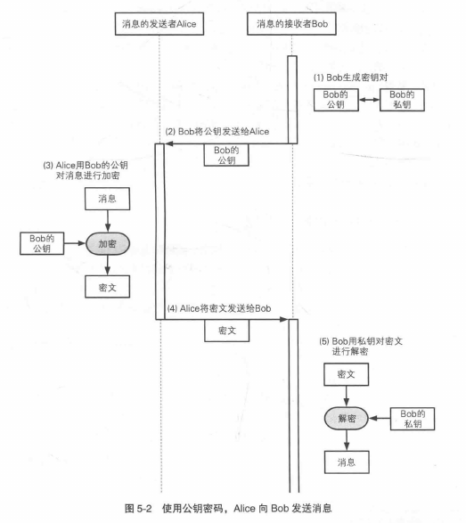

# 公钥密码

## 密钥配送问题

#### 1.通过事先共享密钥来实现。

事先用安全的方式将密钥交给对方，这称为密钥的事先共享。

缺点

1. 难以通过某种方式将密钥发送给不在身边的陌生人
2. 在人数很多的情况下，需要大量密钥

#### 2.通过密钥分配中心来解决

每个员工拥有自己的密钥，一个计算机中保存着所有员工的密钥

通过密钥分配中心（KDC）完成Alice 与 Bob 通信的过程：

(1) Alice 向KDC发送请求，表明要和Bob通信

(2) KDC通过伪随机数生成器生成一个临时的会话密钥

(3) KDC用Alice的密钥加密会话密钥发送给Alice；用Bob的密钥加密会话密钥发送给Bob

(4) Alice解密经加密的会话密钥，然后用该会话密钥加密明文发送给Bob

(5) Bob解密经加密的会话密钥，然后用会话密钥解密发来的密文

(6) Alice和Bob把会话密钥给删除

缺点

1. 随员工数目增多，负荷增大。如果密钥分配中心计算机发生故障，全公司的加密通信就会瘫痪。
2. 如果Malory对密钥分配计算机下手并成功入侵，后果将不堪设想。

#### 3.通过 Diffie-Hellman 密钥交换来解决

加密双方传递一些信息。

根据交换的信息，双方可以各自生成相同的密钥。而窃听者即使能够窃听到交换的信息也无法根据其生成和双方相同的密钥。

#### 4.通过公钥密码来解决

公钥公开，任何人可以加密；私钥私有。

事先把加密密钥发送给对方，让别人用这个加密完明文后发回来，这个加密密钥即使被别人窃听获取也没有关系。因为只有拥有解密密钥的人才能够解密，凭公钥无法解密。

## 公钥密码

#### 公钥通信的流程

#### 公钥密码的问题

1. 公钥认证问题：需要判断所得到的公钥是否正确合法
2. 处理速度只有对称密码的几百分之一

