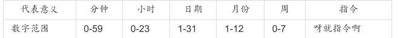
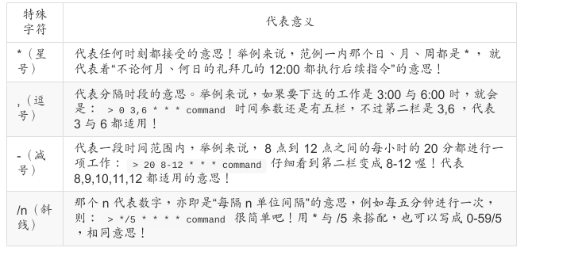

##  Linux 工作调度的种类: at, cron

两种工作调度的方式:

- 一种是例行性的,就是每隔一定的周期要来办的事项;
- 一种是突发性的,就是这次做完以后就没有的那一种 

可使用 at 与 crontab 这两个好东西达到这两个功能。
**at** :at 是个可以处理仅执行一次就结束调度的指令,不过要执行 at 时, 必须要有 atd 这
个服务 的支持才行。
**crontab** :crontab 这个指令所设置的工作将会循环的一直进行下去! 可循环的时间为分
钟、小时、每周、每月或每年等。crontab 除了可以使用指令执行外,亦可编辑
/etc/crontab 来支持。 


#### atd 的启动与 at 运行的方式

要使用单一工作调度时,我们的 Linux 系统上面必须要有负责这个调度的服务,那就是 atd 这
个玩意儿。 不过并非所有的 Linux distributions 都默认会把他打开的,所以呢,某些时刻我们
必须要手动将他启用才行。 启用的方法很简单,就是这样:

```
[root@study ~]# systemctl restart atd # 重新启动 atd 这个服务
[root@study ~]# systemctl enable atd  # 让这个服务开机就自动启动
[root@study ~]# systemctl status atd  # 查阅一下 atd 目前的状态
atd.service - Job spooling tools
	Loaded: loaded (/usr/lib/systemd/system/atd.service; enabled)  # 是否开机启动
	Active: active (running) since Thu 2015-07-30 19:21:21 CST; 23s ago # 是否正在运行中
Main PID: 26503 (atd)
	CGroup: /system.slice/atd.service
		└─26503 /usr/sbin/atd -f
Jul 30 19:21:21 study.centos.vbird systemd[1]: Starting Job spooling tools...
Jul 30 19:21:21 study.centos.vbird systemd[1]: Started Job spooling tools.
```

重点就是要看到上表中的特殊字体,包括“ enabled ”以及“ running ”时,这才是 atd 真的有在
运行的意思喔!


#### at 的运行方式

##### 产生工作的方式是怎么进行的?

事实上，我们使用 at 这个指令来产生所要运行的工作,并将这个工作以文本文件的方式写入 /var/spool/at/ 目录内,该工作便能等待 atd 这个服务的取用与执行了。

##### 进行 at 的使用限制

利用 /etc/at.allow 与 /etc/at.deny 这两个文件

at 的工作情况其实是这样的:
1. 先找寻 /etc/at.allow 这个文件,写在这个文件中的使用者才能使用 at ,没有在这个文件
  中的使用者则不能使用 at (即使没有写在 at.deny 当中);

2. 如果 /etc/at.allow 不存在,就寻找 /etc/at.deny 这个文件,若写在这个 at.deny 的使用者
  则不能使用 at ,而没有在这个 at.deny 文件中的使用者,就可以使用 at ;

3. 如果两个文件都不存在,那么只有 root 可以使用 at 这个指令。
  在一般的 distributions 当中,由于假设系统上的所有用户都是可信任的, 因此系统通常会保留一个空的 /etc/at.deny 文件,意思是允许所有人使用 at 指令的意思 (您可以自行检查一下该文件)。 

  不过,万一你不希望有某些使用者使用 at 的话,将那个使用者的帐号写入 /etc/at.deny 即可! 一个帐号写一行。


### mail

命令行下发送和接收电子邮件

#### 选项

```shell
-b<地址>：指定密件副本的收信人地址；
-c<地址>：指定副本的收信人地址；
-f<邮件文件>：读取指定邮件文件中的邮件；
-i：不显示终端发出的信息；
-I：使用互动模式；
-n：程序使用时，不使用mail.rc文件中的设置；
-N：阅读邮件时，不显示邮件的标题；
-s<邮件主题>：指定邮件的主题；
-u<用户帐号>：读取指定用户的邮件；
-v：执行时，显示详细的信息。
```


**直接使用shell当编辑器**

```shell
mail -s "Hello from jsdig.com by shell" admin@jsdig.com
hello,this is the content of mail.
welcome to www.jsdig.com
```

`-s`表示邮件的主题，后面的`admin@jsdig.com`则是邮件的接收人。

输入完这行命令后回车，会进入邮件正文的编写，我们可以输入任何文字，比如上面的两行。当邮件正文输入完成后，需要按 **CTRL+D** 结束输入，此时会提示你输入Cc地址，即邮件抄送地址，没有直接回车就完成了邮件的发送。

**使用管道进行邮件发送**

```shell
echo "hello,this is the content of mail.welcome to www.jsdig.com" | mail -s "Hello from jsdig.com by pipe" admin@jsdig.com
```

使用管道直接敲入这行命令即可完成邮件的发送，其中echo后的是邮件正文。

**使用文件进行邮件发送**

```shell
mail -s "Hello from jsdig.com by file" admin@jsdig.com < mail.txt
```

使用上面的命令后，我们就可以把mail.txt文件的内容作为邮件的内容发送给[admin@jsdig.com](mailto:admin@jsdig.com)了。


### 实际运行单一工作调度

这个指令的运行非常简单!将 at 加上一个时间即可!

基本的语法如下:

```
[root@study ~]# at [-mldv] TIME
[root@study ~]# at -c 工作号码
选项与参数:
-m :当 at 的工作完成后,即使没有输出讯息,亦以 email 通知使用者该工作已完成。
-l :at -l 相当于 atq,列出目前系统上面的所有该使用者的 at 调度;
-d :at -d 相当于 atrm ,可以取消一个在 at 调度中的工作;
-v :可以使用较明显的时间格式列出 at 调度中的工作列表;
-c :可以列出后面接的该项工作的实际指令内容。

TIME:时间格式,这里可以定义出“什么时候要进行 at 这项工作”的时间,格式有:
HH:MM
 ex > 04:00
在今日的 HH:MM 时刻进行,若该时刻已超过,则明天的 HH:MM 进行此工作。

HH:MM YYYY-MM-DD
 ex > 04:00 2015-07-30
强制规定在某年某月的某一天的特殊时刻进行该工作!

HH:MM[am|pm] [Month] [Date]
 ex > 04pm July 30
也是一样,强制在某年某月某日的某时刻进行!

HH:MM[am|pm] + number [minutes|hours|days|weeks]
ex > now + 5 minutes
 ex > 04pm + 3 days
就是说,在某个时间点“再加几个时间后”才进行。
```

ps: 有个命令叫`batch` ，它系统有空时才进行任务


### 循环执行的例行性工作调度

循环执行的例行性工作调度是由 cron (crond) 这个系统服务来控制的。

archlinux下需要安装 cronie然后启用 cronie服务。

我们可以限制使用 crontab 的使用者帐号喔!使用的限制数据有:

>- /etc/cron.allow: 将可以使用 crontab 的帐号写入其中,若不在这个文件内的使用者则不可使用 crontab;
>- /etc/cron.deny: 将不可以使用 crontab 的帐号写入其中,若未记录到这个文件当中的使用者,就可以使crontab 。

同样的,以优先顺序来说, /etc/cron.allow 比 /etc/cron.deny 要优先, 而判断上面,这两个文件只选择一个来限制而已。因此,建议你只要保留一个即可, 免得影响自己在设置上面的判断!

一般来说,系统默认是保留 /etc/cron.deny , 你可以将不想让他执行crontab 的那个使用者写入 /etc/cron.deny 当中,一个帐号一行!

*ps:当使用者使用 crontab 这个指令来创建工作调度之后,该项工作就会被纪录到/var/spool/cron/ 里面去。*


##### crontab 的语法

```
[root@study ~]# crontab [-u username] [-l&#124;-e&#124;-r]
选项与参数:
-u :只有 root 才能进行这个任务,亦即帮其他使用者创建/移除 crontab 工作调度;
-e :编辑 crontab 的工作内容
-l :查阅 crontab 的工作内容
-r :移除所有的 crontab 的工作内容,若仅要移除一项,请用 -e 去编辑。
范例一:用 dmtsai 的身份在每天的 12:00 发信给自己
[dmtsai@study ~]$ crontab -e
# 此时会进入 vi 的编辑画面让您编辑工作!注意到,每项工作都是一行。
 0  12 * * * mail -s "at 12:00" dmtsai &lt; /home/dmtsai/.bashrc
#分 时 日 月 周 |<==============指令串========================>|
```




比较有趣的是那个“周”喔!周的数字为 0 或 7 时,都代表“星期天”的意思!另外,还有一些辅助的字符,大概有下面这些:




#### 系统的配置文件: /etc/crontab, /etc/cron.d/*

一般来说,crond 默认有三个地方会有执行脚本配置文件,他们分别是:

- /etc/crontab
- /etc/cron.d/
- /var/spool/cron/

“ crontab -e ”是针对使用者的 cron 来设计的，如果是“系统的例行性任务”， 你只要编辑`/etc/crontab` 这个文件就可以了。

基本上, cron 这个服务的最低侦测限制是“分钟”,所以“ cron 会每分钟去读取一次 /etc/crontab /var/spool/cron里面的数据内容 ”。因此,编辑并保存 /etc/crontab 后,那么 cron 的设置就会自动生效!

> Tips : 某些其他的 Unix 系统中,由于 crontab 是读到内存当中的,所以在你修改完 /etc/crontab 之后,可能并不会马上执行, 这个时候请重新启动 crond 这个服务吧!  “systemctl restart crond”(ARCH cronie)

